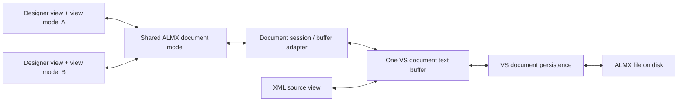

# Milestone two: ALMX document integration

Status: editor implemented and validated on VS2022 and VS2026, including project
Save As and the interactive file-lifecycle checks below. Checkout against a
checkout-based source-control provider remains unverified. The UI uses MVVM with
constructor dependency injection for document models and view models.

The outcome is a WPF alarm designer and an XML source view editing the same
unsaved document, with coordinated Save, Undo/Redo, and document lifetime in
Visual Studio 2022 17.9+ and 2026 x64.

## Scope and starting point

Milestone one provides CPS projects, templates, build integration, and XML editor
registration. Milestone two replaces the designer scaffolds and adds the custom
editor factory, source-edit services, and shared document model.

Milestone two includes:

- An alarm list with selection, add, delete, and basic filtering.
- Editing local `FullyQualifiedName`, `Name`, `Code`, `Category`, `Description`,
  and the literal `ReferenceName`. Renaming an identifier does not rewrite other
  alarms' references in this milestone.
- Ordered local TestProcedure Instructions and Reset entries, with Step, Hint,
  Warning, Note, and Clear kinds; add, edit, remove, and reorder controls.
- A XAML-style document window with Designer, Split, and XML modes, plus two
  editor windows over one document. Keep standard Visual Studio View Code,
  View Designer, and New Window behavior compatible with the combined host.
- Shared dirty state, Save/Save All/Save As, Undo/Redo, close/cancel, reload,
  read-only handling, and rename tracking.
- Recovery when XML is temporarily malformed, and preservation of source text
  outside the operation being performed.

Reference completion, inherited-value presentation,
project-wide live semantic diagnostics, and resolved preview remain milestone
three. Existing procedure sections, references, and `Clear` directives must
survive unrelated edits. Compiler diagnostics continue through the build.

## Editor layout: XAML-style split view

Use the interaction pattern from Visual Studio's WPF UserControl editor: one
document tab containing the graphical editor and source. Microsoft's
[XAML code editor guide](https://learn.microsoft.com/en-us/visualstudio/xaml-tools/xaml-code-editor?view=visualstudio)
documents pane switching, swapping, orientation, and collapsing. Apply that
pattern to an ALMX-specific WPF designer and the XML source editor.

- **Designer:** give the alarm list and detail form the full editor area.
- **Split:** display that designer and XML source together. Default to designer
  above/XML below, with a draggable divider. Offer side-by-side layout and Swap
  Panes for different window sizes and user preferences.
- **XML:** give the source editor the full editor area while preserving the
  designer's selection and current document projection.

Keep the list-and-details layout inside the designer pane. On narrow panes,
collapse the list into an alarm selector so fields remain usable. Keep Add,
Delete, and alarm filtering in the designer toolbar; standard Save and Undo/Redo
remain document commands. Arrange mode/orientation controls in one compact bar.
Remember mode, pane order, orientation, and split proportion as user preferences,
separate from ALMX contents. Layout changes must not dirty the document.

Host a Visual Studio XML text view over the same document data used by the
designer. The XAML editor is the interaction reference; the first prototype must
establish the supported VSSDK hosting route for XML, focus/command routing, and
language-service behavior. A plain WPF TextBox does not provide the intended
source-editor integration. Use a small WPF Grid/GridSplitter host if needed;
this change does not require a general docking framework or the XAML designer's
internal implementation.

Mode switches must not recreate the document model, buffer, or undo history.
Retain each pane's selection/caret/scroll state and commit or report conflicts in
pending field edits before hiding a pane. Invalid XML keeps the source pane
available and suspends designer mutations until parsing recovers. Selection-to-
source navigation can follow after the core split integration works; full
bidirectional semantic navigation remains outside milestone two.

## MVVM and dependency injection

Use Visual Studio's existing MEF composition with constructor injection and typed
factories. The package obtains the composed editor factory at the host boundary.
Factories receive dependencies through constructors and supply runtime document
and view arguments when creating models and view models. Models and view models
must not resolve services themselves. This uses the repository's existing
`System.ComponentModel.Composition` reference; the old dependency-injection
entries in `Directory.Packages.props` do not imply a DI container is in use.

| Component | Responsibility | Lifetime |
| --- | --- | --- |
| `AlmxEditorFactory` | Attach logical views to compatible VS document data; create view hosts through injected factories. | Package |
| `AlmxEditorPane` / `EditorLayoutViewModel` | Host both panes; manage mode, orientation, divider, focus, and view preferences. | One per editor window |
| `AlmxDocumentSessionFactory` | Find or create the session attached to the actual document buffer. | Shared factory |
| `AlmxDocumentSession` | Coordinate the buffer adapter, source model, edits, and document notifications. | One per open document buffer |
| `AlmxDocumentModel` | Expose a versioned projection of local ALMX values and parse status. | One per document session |
| `EditFileControlViewModel` / `AlarmViewModel` | Expose bindings and commands, selection, filtering, and field edit state. | One set per designer pane, retained across mode switches |
| `EditFileControl` | WPF layout, bindings, keyboard focus, and accessibility. | One per designer view |
| XML projection/edit services | Read snapshots and calculate narrowly scoped XML edits. | Stateless/shared where practical |

For example, an `AlmxDocumentModel` receives an injected document-buffer
abstraction and projection/edit services. An `EditFileControlViewModel` receives
that document model and a factory for alarm view models. The view receives its
view model from the view factory. Use `INotifyPropertyChanged`, collection
notifications, and `ICommand`; code-behind is limited to view concerns.

The session factory keys sharing by the VS document buffer identity, rather than
creating another model for every window or project. MEF's shared lifetime alone
does not provide a document scope: implement that ownership explicitly. Separate
views share document content but retain independent selection and filtering.
Plain alarm snapshot values are data, not services needing DI registrations.

Keep host-independent model/edit logic free of COM and WPF types behind small
interfaces. Keep these folders in the existing extension project initially:
`Editor/` for VSSDK adapters and command routing, `Documents/` for sessions and
models, `Editing/` for XML projection and edits, and `UI/` for views/view models.
Mirror the responsibilities in the existing unit-test project. Preserve the
extension's `net472` target and the compiler's existing frameworks and contracts.

## Shared file handling and its references

The original architecture reference was Microsoft's
[Supporting Multiple Document Views](https://learn.microsoft.com/en-us/visualstudio/extensibility/supporting-multiple-document-views?view=visualstudio).
It separates the document data object from the view objects. Each view displays
the same underlying document data; a standard `VsTextBuffer` can notify views
when that data changes. This is the basis for the implemented sharing arrangement.



The [Running Document Table](https://learn.microsoft.com/en-us/visualstudio/extensibility/internals/running-document-table?view=visualstudio)
(RDT) tracks open document data, its moniker, and locks held by document windows.
It participates in save prompts and document lifetime. A file path is a lookup
identity that can change on rename or Save As; it is not a reason to create a
second editing buffer. RDT locks track IDE ownership, not operating-system
`FileShare` access modes.

In `IVsEditorFactory.CreateEditorInstance`, inspect `punkDocDataExisting` and
reuse compatible data. For unsupported document data, return the standard
incompatible-data result rather than creating an independent copy. This follows
[Attach Views to Document Data](https://learn.microsoft.com/en-us/visualstudio/extensibility/how-to-attach-views-to-document-data?view=visualstudio).
When no data exists, create the standard VS text document data and return it for
the shell to manage. Confirm the necessary `IVsTextLines`/`IVsTextBufferProvider`
interfaces during the first implementation step.

Use the editor adapter service to obtain the managed document buffer from that
document data. Its
[`GetDocumentBuffer`](https://learn.microsoft.com/en-us/dotnet/api/microsoft.visualstudio.editor.ivseditoradaptersfactoryservice.getdocumentbuffer?view=visualstudiosdk-2022)
API can return null before content is established, so initialization must handle
that stage. An independently created `ITextBuffer` containing the same text would
not satisfy the shared-document requirement.

For example, changing an alarm description in the designer produces an edit to
this buffer. The XML view sees the edit immediately; all designer models refresh
from the resulting snapshot. Typing in XML follows the same path in reverse.
Neither view independently writes the file. Save delegates to VS document
persistence, and Undo/Redo uses the buffer's history.

Microsoft's older
[WPF XML designer registration sample](https://github.com/microsoft/VSSDK-Extensibility-Samples/blob/master/WPFDesigner_XML/WPFDesigner_XML/VsTemplateDesignerPackage.cs)
shows cooperation with the XML editor through
`ProvideXmlEditorChooserDesignerView` and logical-view registration. Use it as a
registration reference; verify the actual behavior against this repository's
17.9 API baseline and CPS project type. It is not evidence that the new editor
already works on either supported host.

For the boundary between open text and derived models,
[Roslyn's Workspace_Editor.cs](https://github.com/dotnet/roslyn/blob/main/src/Workspaces/Core/Portable/Workspace/Workspace_Editor.cs)
is a secondary reference: it associates open documents with text containers and
subscribes to changes. Adapt that separation at this project's scale without
adding a Roslyn dependency or a solution-wide workspace in milestone two.

## Source-preserving edits and synchronization

The text buffer is authoritative; parsed models are projections. The current
`AlmxFile` reader skips unknown elements and its writer regenerates known XML.
`AlarmSyntaxNode` getters can also return inherited values after binding. Neither
whole-file serialization nor binding the designer directly to resolved compiler
nodes is suitable for editing literal local source values.

- Build an editor-side XML projection with element/value spans and a snapshot
  version. Reuse ALMX names and verify parity with compiler fixtures. Read local
  values directly, preserving the distinction between absent and empty fields.
- Validate XML with DTD processing prohibited and external resolution disabled.
  Use a span-aware XML token layer for edits, not regular expressions or a
  whole-document `XDocument.Save`. Preserve comments, unknown elements,
  attributes, procedure sections, whitespace, and line endings outside the
  selected change. Preserve document encoding through VS persistence.
- Replace only the selected scalar content; insert/remove a field or alarm at
  a verified structural boundary. Escape XML text correctly and cover CDATA,
  entities, self-closing elements, and namespace context. If a construct cannot
  be edited safely, disable that operation and explain how to edit it in XML.
- Treat `<Alarmlist/>` as an editable empty list in the editor projection. The
  existing compiler reader returns no tree for that form; do not change that
  public behavior as an incidental editor fix.
- Commit field changes on Enter/focus loss, and before Save or view closure;
  Escape cancels a pending field edit. Keep pending field state separate from
  the shared committed source. Check its starting version/value before commit;
  if another view changed that target, surface the conflict without overwriting
  the newer content. Save/close must also account for the active pending field.
- Apply each accepted designer action atomically through the shared buffer and
  group it into one document undo transaction. Use VS's existing buffer undo
  manager/history; test command routing while a WPF text box has focus, including
  its temporary field edits. Do not add a separate model undo stack.
- Subscribe once per session. Reading snapshots and publishing notifications
  must never trigger another write. The implementation parses current snapshots
  synchronously; background parsing and large-file tuning are deferred. Apply buffer changes and WPF
  notifications on their required UI thread.
- On malformed XML, keep the source editable and show the designer's parse
  error state. Disable model mutations until a current valid projection exists;
  never write a cached valid model over newer invalid source.
- Views release their subscriptions on close. Dispose the document session on
  final document closure, including when the XML view outlives all designer
  windows. Release only owned resources and balance any explicitly acquired
  RDT locks; let standard window frames manage their own locks.

The implementation references for atomic text changes and undo are
[`ITextEdit`](https://learn.microsoft.com/en-us/dotnet/api/microsoft.visualstudio.text.itextedit?view=visualstudiosdk-2022),
[`ITextBufferUndoManagerProvider`](https://learn.microsoft.com/en-us/dotnet/api/microsoft.visualstudio.text.operations.itextbufferundomanagerprovider?view=visualstudiosdk-2022),
and [`ITextUndoHistoryRegistry`](https://learn.microsoft.com/en-us/dotnet/api/microsoft.visualstudio.text.operations.itextundohistoryregistry?view=visualstudiosdk-2022).
The composition choice follows
[MEF in the editor](https://learn.microsoft.com/en-us/visualstudio/extensibility/managed-extensibility-framework-in-the-editor?view=visualstudio).

## Implementation sequence and acceptance criteria

| Step | Work | Evidence required before proceeding |
| --- | --- | --- |
| 1. Prove document integration | Add a minimal combined designer/XML host, logical-view registration, buffer reuse, and a single test edit command. Adapt package registration and the existing XML `.pkgdef` coherently. | Embedded XML view, XML-first and designer-first opening share document data and undo history on VS2022 and VS2026. A designer edit is visible and undoable in XML, and vice versa. Focus routing, mode switching, Save, reopen, and two simultaneous windows work. |
| 2. Establish injection and ownership | Add typed factories, buffer/persistence abstractions, document session/model, and per-view view models. | Two views receive the same document model but different view models; two files receive different models. Closing one view retains the other; final close removes subscriptions. |
| 3. Implement source editing | Add snapshot projection, span edits for scalar fields/add/delete, XML preservation, and invalid-source recovery. | Exact text assertions show untouched content survives; stale edits and unsafe targets leave the buffer unchanged. Empty roots support adding the first alarm. |
| 4. Build the MVVM designer | Complete the existing WPF scaffold with list, filter, details, commands, and validation messages. Add Designer/Split/XML modes, both split orientations, swapping, resizing, and saved layout preferences. | All required fields and add/delete work through bindings; literal references remain editable. Pane state survives mode changes, layout changes do not dirty XML, and keyboard use and VS themes are usable. |
| 5. Complete lifecycle behavior | Integrate Save All/Save As, focused-field commits, undo routing, rename, external changes, and read-only/query-edit handling. | Cancelled saves/checkout/reloads retain unsaved text. External changes with local edits use the VS conflict workflow. Rename/Save As update identity without duplicating the session. |
| 6. Package and document | Update VSIX registration/content tests, IDE smoke coverage, and the README. | New editor registration and MEF composition load on both hosts; milestone-one project creation and builds still pass. Record host versions and smoke logs. |

Step one is the main technical uncertainty: embedded XML editor interoperability,
focus/command routing, and its undo bridge must be demonstrated before expanding
the UI. If the chosen registration/adapter route cannot share the existing
document data, revise that route and this plan before proceeding. Do not
compensate with a second buffer.

## Validation plan

Use the existing `Alarmlist.VisualStudio.UnitTests` project for model/command,
injection-lifetime, XML-preservation, stale-version, malformed-source, DTD, and
cleanup tests. Include concurrent views editing the same field and different
fields, comments/unknown nodes, empty roots, CRLF/LF, and XML escaping.

Extend the existing package integration tests for editor registration and VSIX
assets. These tests still run on both repository frameworks; editor unit tests
remain `net472`. Run from the repository root:

```powershell
dotnet test src/VisualStudio/Alarmlist.VisualStudio.UnitTests/Alarmlist.VisualStudio.UnitTests.csproj
dotnet test src/VisualStudio/Alarmlist.VisualStudio.IntegrationTests/Alarmlist.VisualStudio.IntegrationTests.csproj
dotnet test src/SDK/Alarmlist.SDK.Tests/AlarmList.MSBuild.SDK.Tests.csproj
```

Extend `eng/test-visualstudio.ps1` where its automation supports the scenario and
record manual experimental-instance checks for WPF focus/commands and multiple
views. Verify both opening orders, cross-view undo, Save All with an active field,
Save As, dirty close/cancel, XML-only survival after designer closure, invalid XML
recovery, read-only files, external reload/conflict, and rename on each supported
host. Also verify all three modes, both orientations, swapping/resizing, retained
selection/caret state, restored layout preferences, and Undo/Redo from either
focused pane. Package inspection cannot establish those UI behaviors.

Run compiler tests on both frameworks if implementation requires compiler
changes. Preserve the existing SDK/Arcade configuration and use the current
package versions unless step one demonstrates a specific missing API. Any new
dependency needs an explicit compatible version in both the affected project
and the repository's version listing.

## Implementation decisions and validation record

The source pane embeds the native VS code window through `IVsUIElementPane`.
Creating that complete element initializes XML coloring and language services.
The factory defers view initialization until VS has loaded the document buffer.
The session is attached to the buffer property collection; its host-specific
lifetime and draft coordination are in `Editor/`. Models and edit services remain
independent of Visual Studio services. No dependency versions or compiler/SDK
contracts were changed.

Project-item Save As uses a CPS `IFileActionHandler` to reconcile the persisted
buffer path with project ownership. The pinned CPS SDK marks this hook obsolete,
but exposes it on both supported hosts. The handler reads `IPersistFileFormat`'s
actual filename because native XML persistence can omit its new-moniker result.
It creates the destination item with source metadata, transfers the existing
document through `IVsProject3.TransferItem`, then removes the old source item
without deleting its disk file. This order keeps both views alive and prevents
duplicate compilation through default globs. External destinations receive Link
metadata. Save As back to an excluded original filename is covered as well.
This follows the shell's document-ownership model described in
[Persistence and the Running Document Table](https://learn.microsoft.com/en-us/visualstudio/extensibility/internals/persistence-and-the-running-document-table?view=visualstudio).

Validation on 2026-09-24: 57 extension unit tests, 20 extension integration tests
(10 per framework), and the final native code-window experimental IDE smoke on
both VS2022 and VS2026 passed. The SDK suite previously passed 34 tests (17 per
framework); SDK contents were unchanged. See the README for host versions and logs.

The smoke now checks local and linked project-item Save As, returning to the
original filename, unchanged buffer/RDT identity across two views, subsequent
saves, original-file preservation, and a build with one compiler input. It runs
these checks for both the ALMX and standard XML editors. The duplicate-view command
is resolved by stable command GUID/ID: VS2026 calls it `Window.NewTab`, whereas
`Window.NewWindow` now floats a tab. The earlier disposed-window failure came from
the smoke closing that original tab; it did not require an editor-host workaround.

Interactive checks passed on both hosts for dirty-close cancellation, clean
external reload into the designer, declining reload with local edits, cancelling
overwrite of an externally modified file, and cancelling the Git provider's
read-only edit prompt. Rejected drafts remained available and saved after write
access was restored; disk contents stayed unchanged during cancellation.
VS2022 also exercised cancellation of the native read-only Save As fallback.
VS2026 project Save As through the actual dialog accepted a filename containing
spaces, ampersand, percent, and semicolon; its next save preserved the original.

Earlier interactive checks cover native XML coloring, side-by-side editing,
focused-field Save All, loose-document Save As, and TestProcedure Instructions/
Reset creation, escaping, removal after typing, and shared Undo in VS2022.
Checkout against a checkout-based provider and large-file parsing performance
have not been tested. Git's read-only Query Edit workflow is covered above.
