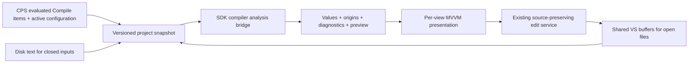

# Milestone three: reference-aware ALMX editing

Status: planned; no milestone-three behavior is implemented by this document.
The procedure interaction below is the recommended design. Continue the MVVM,
constructor injection, and shared document-buffer architecture from
[milestone two](MILESTONE-2.md).

The outcome is a designer that explains where an alarm's effective values come
from, supports reference selection and navigation, and shows live compiler
diagnostics and a resolved preview across the current project's ALMX inputs.

## Starting point and scope

The current designer edits local XML values and ordered local procedure entries.
It does not yet display inherited values. The compiler already resolves references
across files, scalar fallback, ordered procedure inheritance, and `Clear`.
Milestone three exposes those existing semantics without changing the ALMX format.

Include:

- Project-scoped reference completion in the designer and Go to reference/source.
- Effective Name, Code, Category, and Description with inheritance provenance.
- A WPF `Adorner` and chain icon on fields displaying a referenced value.
- Inherited/local procedure presentation for Instructions and Reset, with explicit
  section commands for replacing inheritance or making a local copy.
- Live ALM0001-ALM0004 diagnostics, source navigation, and a read-only resolved
  preview using current document-buffer contents.

Project-wide rename/refactoring, cross-project reference semantics, individual
inherited-step overrides, XML IntelliSense/squiggles, and changes to output format
are outside this milestone. The XML pane retains its existing language service.

Milestone two still records project-item Save As/RDT identity problems and an
`ObjectDisposedException` with the final VS2026 editor host. Resolve and validate
these before accepting milestone three: the project index depends on reliable
document identity and lifetime. Retain its outstanding checkout, external-change,
and dirty-close checks; do not mark them complete based on package tests.

## Semantic contracts to preserve

The implementation and tests in `../Compiler/Syntax/AlarmSyntaxNode.cs`,
`../Compiler/Syntax/ReferenceableCollection.cs`,
`../Compiler.UnitTests/Syntax/AlarmTests.cs`, and
`../Compiler.UnitTests/Syntax/ReferenceableCollectionTests.cs` establish:

| Subject | Existing behavior and design consequence |
| --- | --- |
| Scalar fallback | Name, Code, Category, and Description inherit when the local string is null or empty. An explicit empty XML element still falls back. A nonempty local value wins, even when it equals the inherited text. |
| Identity | FullyQualifiedName and ReferenceName are local identifiers, not inherited fields. Reference lookup uses ordinal, case-sensitive names. |
| Procedure composition | Start with the referenced alarm's resolved section, then process local entries in source order. Instructions and Reset resolve independently. |
| Clear | Discard every preceding entry in that section, including preceding local entries. Clear is a source directive and is absent from the effective sequence. Multiple Clears are valid. |
| Step identity | Entries have kind and text, with no stable semantic step identifier or individual override/remove directive. Position and equal text cannot identify an inherited step for replacement. |

Keep source presence, raw local text, effective value, and origin separate.
`IsPresent` must continue to describe the XML. Do not equate a checked checkbox
with an effective local override, or infer inheritance by comparing strings.
Changing explicit-empty behavior would be a separate compiler-format decision.

## Project analysis and ownership

Add a small project analysis service alongside the existing document services.
The design follows Roslyn's separation of source, semantics, and host integration:
its [Workspace implementation](https://github.com/dotnet/roslyn/blob/main/src/Workspaces/Core/Portable/Workspace/Workspace.cs)
exposes a current immutable project/document snapshot. Adapt that pattern to an
ALMX project; do not introduce a Roslyn dependency or its complete workspace stack.



Suggested responsibilities, with names finalized during implementation:

| Component | Responsibility and lifetime |
| --- | --- |
| CPS project-input adapter | Subscribe to evaluated Compile membership, configuration, project/SDK changes, and unload. One subscription per project context. |
| Project analysis service | Own immutable input/result snapshots, scheduling, and cancellation per project context. Share results among designer windows. |
| Compiler analysis bridge | Analyze snapshot text with the project's resolved SDK compiler; return host-independent result data. Never own document persistence. |
| Document model/edit service | Retain local XML projection, version checks, drafts, and targeted edits through the existing buffer session. |
| Field/procedure view models | Combine local source and current semantic results without writing inherited values back. Remain per view. |
| WPF inheritance behavior | Attach/detach adorners and expose visual state; contain no binding or compiler rules. |

Keep CPS/VSSDK adapters in `ProjectSystem/` and `Editor/`, project analysis models
in a proposed `Analysis/` folder, and presentation in `UI/`. Use typed factories
and constructor injection through existing MEF composition. No service lookup
inside models/view models. Update AGENTS.md's project map when these folders are
actually introduced.

Input and scheduling rules:

- Use evaluated `Compile` items for the active project configuration, including
  explicit/conditional items and SDK exclusions. Do not independently glob files
  or index all files in the solution. Preserve input order and compiler name rules.
- An open file's current shared buffer wins over disk, including when only the
  XML editor is open. Uncommitted control drafts stay local until normal commit.
  Analysis must neither save documents nor invoke an output-writing Build target.
- Observe closed-file changes, membership changes, rename, Save As, buffer close,
  configuration switches, SDK changes, and project unload. A file linked into two
  projects shares its buffer but gets separate results for each project context.
- Capture immutable text and input versions; debounce edits (initially 250 ms),
  perform compiler work off the UI thread, and cancel superseded requests. Publish
  only when the project generation, configuration, and document versions still
  match. Never share the compiler's mutable syntax nodes between runs or views.
- Do not overwrite active drafts on a semantic refresh. After an upstream edit,
  refresh inherited presentation, but require a current result for commands that
  copy effective values. Validate all participating versions before such a write.
- For malformed or unreadable input, mark project analysis incomplete and clear
  obsolete live errors. Retain local editing in other valid documents. Do not
  present cached inheritance as current or flood Error List with missing-reference
  errors caused only by an input that could not be parsed.
- Loose files retain local editing and parsing. Project-wide semantics require an
  owning project with a compatible resolved SDK; show that state explicitly for
  loose/excluded files or unavailable SDKs. Do not borrow an arbitrary project's
  compiler or reference universe. Offer a context choice for shared project items.
- Dispose subscriptions and pending work on project unload, without disposing
  shared document sessions still owned by Visual Studio.

## Compiler boundary and source provenance

Keep the SDK's compiler authoritative. The VSIX currently has no compiler project
reference and must not acquire a private compiler copy for this feature. Start
with a feasibility slice that obtains the restored SDK location from project
evaluation and analyzes unsaved text with its `tasks/net472` compiler. Prove
version compatibility and isolation when two projects use different SDK versions;
record the loading/isolation mechanism before implementing the full UI. If the
SDK is unavailable or lacks the analysis contract, retain local editing and give
a precise restore/version message. Never silently substitute another compiler.

Extend the compiler with a host-independent analysis result for source identity,
field origin, surviving procedure-entry origin, and diagnostic locations. Reuse
its ALMX parser, Binder, and resolution rules; the extension's XML projection
remains responsible for safe text edits, not a second semantic implementation.
Adapt snapshot text through the parser without temporary saves. Preserve DTD
prohibition and unknown-element skipping.

Origins need document identity, snapshot version, alarm identity/source position,
field or procedure section/entry position, and source span. Report the actual
defining alarm through multi-hop references, with the intermediate reference chain
available for explanation. Do not key provenance only by FullyQualifiedName:
duplicates and unnamed alarms must remain distinguishable. Equal procedure text
does not imply equal origin. For UI explanations, also expose which Clear excluded
an entry; keep excluded entries out of the resolved output model.

Compiler diagnostics currently have no source spans. Add optional source
locations without breaking existing constructors, IDs, or location-free callers.
Capture locations while parsing and binding, not by searching message text.
Duplicate definitions need related locations; missing/self/circular references
must identify the relevant ReferenceName declarations. Use the same location data
for designer navigation and MSBuild file/line logging when available. All compiler
APIs remain compatible with `net472;net8.0` and independent of WPF/CPS.

This analysis contract requires a matching SDK release. Preserve both task
runtimes, package-content checks, existing Arcade imports, and SDK-first release
ordering. Extend the package rather than introducing a second compiler path.

## Design note: inherited scalar fields

Use a custom `InheritedValueAdorner : System.Windows.Documents.Adorner` to draw
a chain icon when a field is displaying a value supplied by a referenced alarm.
This is a required part of the design. Scope it to Name, Code, Category, and
Description; merely having a ReferenceName must not decorate local overrides.

| State | Presentation and editing |
| --- | --- |
| Effective local value | Show the local value normally, without a chain icon. |
| Effective inherited value | Show the effective value and chain icon, with origin text such as "Inherited from Base.Pump in Common.almx". |
| Explicit empty local element | Keep its presence checkbox checked and preserve the empty XML value; show the inherited effective value with the same icon and an explanation that the local element is empty. |
| No effective value | Show an empty field; do not imply that a referenced alarm supplies a value. |
| Invalid/unavailable analysis | Keep local source accessible and show diagnostic/pending state separately from inheritance. |

Keep a one-way effective display separate from the two-way local draft. Inherited
presentation is read-only and selectable. **Override locally** starts a local
draft seeded from the current effective value; normal commit writes only the
selected field. **Use inherited value** removes that local element. Both follow
the existing conflict checks and shared Undo/Redo. Keep the explicit presence
control for XML fidelity. Empty committed values still follow compiler fallback.
An untouched inherited display, focus change, preview refresh, or Save must never
materialize an override. Escape cancels the draft without changing XML.

Microsoft's [WPF adorner documentation](https://learn.microsoft.com/en-us/dotnet/desktop/wpf/controls/adorners)
describes the separate AdornerLayer, attaching via GetAdornerLayer/Add, and
pass-through hit testing. Use an `AdornerDecorator` in the designer to provide a
layer. An attached behavior manages creation/removal when controls load, unload,
change data context, or change inheritance state; supply state explicitly because
the layer owns the adorner. Set the decorative adorner's `IsHitTestVisible=false`.

Reserve space for the glyph so it cannot cover text, caret, scrollbars, or
validation indicators. Use a vector chain icon and VS theme brushes; check DPI,
high contrast, scrolling, and pane resizing. Put tooltip and accessible origin
text on the field, plus a keyboard-accessible **Go to source** command outside
the decorative overlay. Keep these commands available in read-only files where
navigation is still possible. The icon must not be the only indication of origin.

## Recommended TestProcedure interaction

Use the same chain visual language at **row level**, with independent controls
for **Instructions** and **Reset**. Each section shows inherited entries followed
by local source entries. Inherited rows have a chain adorner on their row container,
origin text, and Go to source; their text/kind are read-only. Local rows retain
the existing edit, add, remove, and move controls. Moving a local row only changes
the local sequence. Never mutate a referenced alarm through its child's controls.

Show Clear as a visible divider labelled **Clear preceding entries**. Entries it
excludes belong in an expandable group labelled **Excluded by Clear**, including
any earlier local rows. They remain in XML and can be inspected or edited there
or through the supported local controls. An **Effective sequence** view hides
excluded rows and Clear directives and numbers the surviving entries. The UI must
not confuse source-entry position with effective execution order. Preserve
Step/Hint/Warning/Note kinds and multi-hop origins in both sections.

Suggested section commands:

| Command | Source effect and resulting behavior |
| --- | --- |
| Add local entry | Use existing append behavior. With no local Clear, inherited entries remain first and continue updating. |
| Use local entries only | Insert a leading Clear if needed; preserve existing local entries and directives in their order. Existing later Clears retain their effect. The other section is untouched. |
| Make local copy | Replace the selected section's supported contents with a leading Clear followed by its entire current effective sequence, each surviving row exactly once. All copied rows become local and editable; future reference changes no longer flow into this section. |
| Go to source | Open the defining alarm/entry through VS document navigation. Editing there uses its own document session and affects every referencing alarm after commit. |

The lack of step IDs is why a section-level local copy is preferable to an
"override this inherited row" control. Adding one copied row would append a
duplicate, and a Clear followed by only that row would remove the rest of the
inherited sequence. Making the whole effective section local expresses the
intended behavior with today's format.

For example, if Base supplies `Step: Isolate supply` and Child adds
`Warning: Check pressure`, Child's effective Instructions contain both rows.
Making that section local produces:

```xml
<Instructions>
  <Clear />
  <Step>Isolate supply</Step>
  <Warning>Check pressure</Warning>
</Instructions>
```

The rows now have no chain icons. Child can edit or remove either row; Reset
continues to inherit. Explain before executing that this is a snapshot and future
base changes will not propagate. Undo restores the exact original section and
its inheritance. Removing the leading Clear later would append those copies to
the inherited entries, so it is not a general-purpose "relink" operation.

Implement section commands as one version-checked buffer edit/undo transaction.
Commit or resolve pending drafts first. Disable copy while analysis is incomplete,
stale, or the reference chain is invalid. Preserve surrounding XML and the other
section. Refuse transformations that cannot preserve comments, attributes,
unknown nodes, nested markup, or duplicate sections, with the existing edit-in-XML
guidance; do not normalize or silently discard them. The effective preview remains
read-only even when local rows in the source-oriented view are editable.

## Reference selection, diagnostics, and preview

Reference completion uses the current project index and commits only the chosen
FullyQualifiedName to ReferenceName. Show name, identifier, and defining file;
exclude the current alarm and do not offer ambiguous duplicate names as a valid
selection. Prevent known cycles through the picker. Literal XML/text entry stays
possible and is checked by the compiler. Go to reference opens the immediate
target; a field/row's Go to source opens the actual defining value. Navigation
must revalidate stale locations and use existing document buffers.

Publish live compiler errors in the designer and an ALMX-owned Error List source,
with navigable file/line locations and IDs ALM0001-ALM0004 unchanged. Mark these as
live analysis, retain the existing Build diagnostics provider, and do not delete
its entries when live results refresh. Replace only this provider's obsolete
results, including on project unload/configuration changes. Report parse/input
failures separately; do not invent reference diagnostics for incomplete analysis.

Provide a read-only selected-alarm resolved preview: effective scalars, surviving
Instructions/Reset entries, and origin links. Offer resolved XML using the existing
compiler/output writer in memory, retaining `AlarmList` casing. Source serialization
remains `Alarmlist` with references/directives. Block a successful compiled XML
preview when the compilation fails; never overwrite a previous output file.
Label pending or incomplete results and which project configuration they use.

## Implementation sequence and acceptance

| Step | Work | Evidence required |
| --- | --- | --- |
| 1. Stabilize the baseline | Close the recorded Save As identity and VS2026 lifecycle issues; complete outstanding lifecycle checks. | Shared buffer identity, save/reopen, XML-only survival, and both supported IDE hosts verified. |
| 2. Prove compiler analysis access | Prototype resolved-SDK loading/isolation, snapshot parsing, and a small provenance/location result. | Unsaved cross-file input resolves without disk writes; different SDK versions coexist or produce a clear compatibility state; no private compiler in VSIX. Record the chosen bridge mechanism. |
| 3. Add project snapshots | Implement CPS input subscriptions, buffer/disk precedence, cancellation, and result publication. | Conditional/removed inputs, configuration changes, linked files, closed-file changes, invalid input, and unload cannot publish obsolete results. |
| 4. Add references and scalar UI | Implement completion/navigation, effective field state, override commands, and chain adorners. | Multi-hop origin, empty local values, identical local/inherited text, active drafts, Undo, keyboard access, and themes behave as specified. |
| 5. Add inherited procedures | Implement row origins, Clear presentation, effective sequence, and section commands. | Instructions/Reset remain independent; whole-section copy preserves effective behavior without duplicating local rows; source preservation and atomic Undo verified. |
| 6. Add diagnostics and preview | Integrate navigable live errors, MSBuild locations, and in-memory output preview. | Compiler/build/live results agree for identical inputs; unsaved edits update live results; failures never produce a successful preview or new compiled output. |
| 7. Package and validate | Update SDK/VSIX content tests, smoke coverage, READMEs, and release requirements. | Both frameworks and IDE hosts pass the relevant matrix; supported SDK contract/version is documented and published before distributing its VSIX. |

## Validation plan

Extend compiler parsing/binding/syntax/output tests for origin and location data,
multi-file/multi-hop references, duplicate names, missing/self/circular references,
empty versus absent scalars, whitespace, local values equal to inherited values,
and procedure ordering with multiple Clears. Assert unchanged effective compiler
output and diagnostic IDs on both frameworks.

Extend extension tests for snapshot races and cancellation, active configuration,
unsaved XML-only buffers, project membership changes, project isolation, document
identity changes, draft conflicts, and subscription cleanup. Verify commands by
their observable XML changes and effective results. Include copy of mixed inherited
and local rows, empty sections, each procedure kind, independent Reset, upstream
changes during copying, unsafe markup rejection, and exact-text Undo restoration.

Exercise adorners on an STA dispatcher and in both experimental IDE hosts:
correct attach/detach, no duplicate/leaked decorations after selection or mode
changes, scrolling/clipping, keyboard navigation, read-only copy, theme/high
contrast, and DPI changes. Record VS2022 and VS2026 smoke versions/logs. Package
tests cannot verify these interactions or shared undo across live editor windows.

Run from the repository root during implementation:

```powershell
dotnet test src/Compiler.UnitTests/Alarmlist.Core.UnitTests.csproj
dotnet test src/MSBuild/AlarmList.MSBuild.UnitTests/AlarmList.MSBuild.UnitTests.csproj
dotnet test src/MSBuild/AlarmList.MSBuild.IntegrationTests/AlarmList.MSBuild.IntegrationTests.csproj
dotnet test src/SDK/Alarmlist.SDK.Tests/AlarmList.MSBuild.SDK.Tests.csproj
dotnet test src/VisualStudio/Alarmlist.VisualStudio.UnitTests/Alarmlist.VisualStudio.UnitTests.csproj
dotnet test src/VisualStudio/Alarmlist.VisualStudio.IntegrationTests/Alarmlist.VisualStudio.IntegrationTests.csproj
```

Benchmark a representative large project before accepting live analysis: capture
input size, typing responsiveness, analysis latency, cancellation, and retained
memory after repeated open/close. Start with full project recomputation; introduce
incremental invalidation only if measurements justify its additional complexity.

Planning validation: implementation, nearby tests, project/package configuration,
WPF documentation, and Roslyn's workspace source were reviewed. This documentation
change does not constitute an implementation or a new build/test pass.
